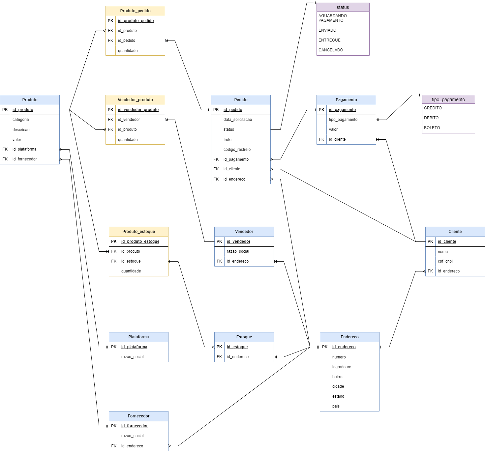

### 🛒 PROJETO E-COMMERCE — Conceitos & Regras

---

### 🧩 Contexto

- Os produtos são vendidos por uma única plataforma, podendo ter vendedores terceiros.
- Cada produto tem um fornecedor.
- Um pedido é composto por um ou mais produtos.
- Clientes podem se cadastrar com CPF ou CNPJ.
- O endereço do cliente determina o valor do frete.
- Um cliente pode fazer vários pedidos e possui um período de carência para devolução.
- O pedido pode ser cancelado conforme regras da operação.

---

### 🧱 Entidades

- Produto
- Cliente
- Pedido
- Fornecedor
- Estoque

---

### 🔗 Relacionamentos

- Realiza: Cliente → Pedido
- Contém: Pedido ↔ Produto
- Fornece: Fornecedor → Produto
- Controla: Estoque → Produto

---

### 📏 Regras de Negócio (sugeridas)

- Cadastro do cliente identifica via CPF/CNPJ.
- Frete calculado a partir do endereço do cliente.
- Devolução permitida dentro do período de carência definido.
- Cancelamento permitido até antes da expedição.
- Estoque reserva quantidades quando o pedido é confirmado; baixa ao faturar; devoluções retornam ao estoque.

---

### 🧠 Pontos para decidir (Fornecedor & Estoque)

- Modelo de reposição: por pedido mínimo, ponto de ressuprimento ou lead time do fornecedor?
- Níveis de estoque: disponível, reservado e avariado serão acompanhados?
- Política de fornecedores: um produto pode ter fornecedores alternativos? como priorizar?
- Centros de distribuição: o estoque será por localidade (CD/loja) ou centralizado?

--

### Mapa Relacional

#### Algumas das perguntas que podem ser feitas para embasar as queries SQL

**Quantos pedidos foram feitos por cada cliente?**

- R: <a href='./scripts/Q1__top_pedidos_por_clientes.sql'>Resposta 1</a>

**Algum vendedor também é fornecedor?**

- R: <a href='./scripts/Q2__vendedor_fornecedor.sql'>Resposta 2</a>

**Relação de nomes dos fornecedores e nomes dos produtos.**

- R: <a href='./scripts/Q3__relacao_produto_fornecedor_estoque.sql'>Resposta 3 e 4</a>

**Relação de produtos, fornecedores e estoques.**

- R: <a href='./scripts/Q3__relacao_produto_fornecedor_estoque.sql'>Resposta 3 e 4</a>
